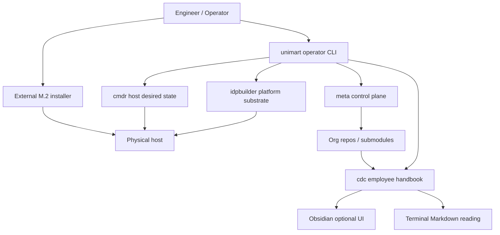
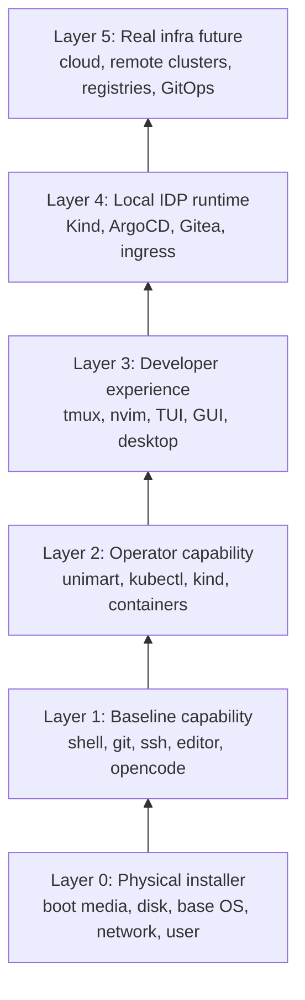
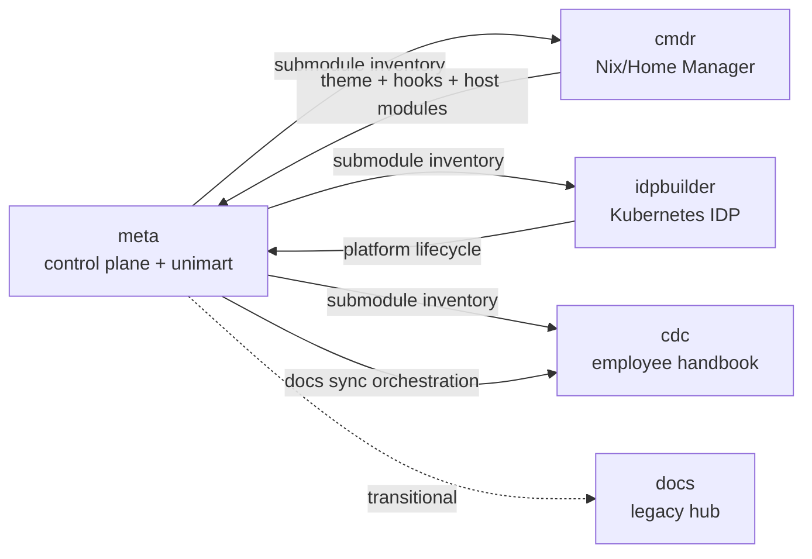
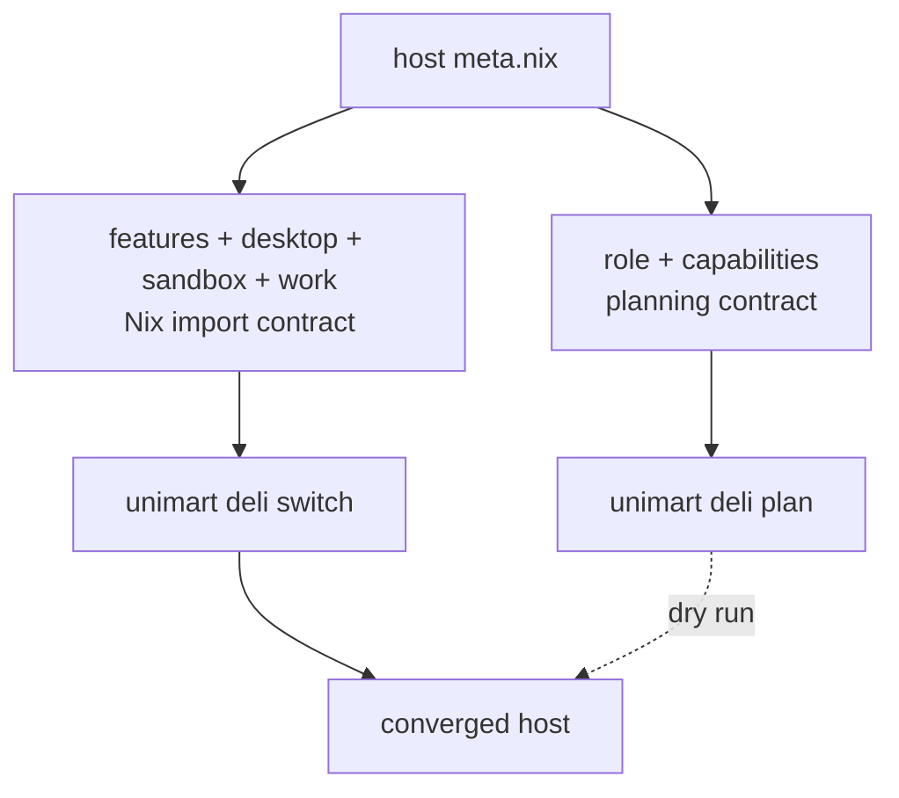
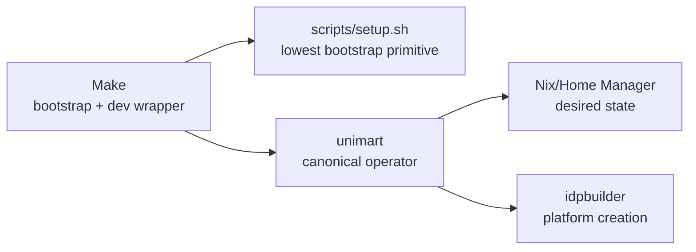
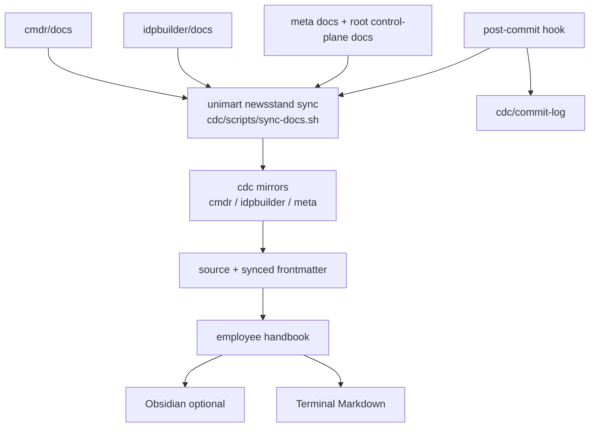
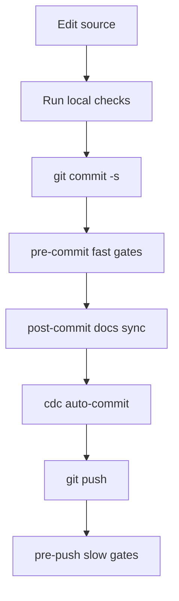

# Mental Model

This repo is a control plane for turning a physical machine into an idpbuilder development unit. The project is intentionally unconventional, but each layer should stay conventional and boring.

## One Sentence

`meta` owns orchestration, `cmdr` owns host desired state, `idpbuilder` owns the local IDP substrate, and `cdc` owns the generated handbook.

## Control Plane Map



## Layer Cake



The external installer should only get the host to Layer 0. `cmdr` and `unimart` converge the rest.

## Repo Roles



## Host Capability Contract

Hosts declare intent in `cmdr/home/02-hosts/<distro>/<host>/meta.nix`.

```nix
role = "developer-workstation";
capabilities = [ "baseline" "terminal-dev" "operator" "idp-local" "desktop" ];

features = [ "cli" "tui" "gui" ];
desktop = [ "hyprland" "dms" ];
```



`role` and `capabilities` explain what the unit should become. `features`, `desktop`, `sandbox`, and `work` choose the concrete Nix modules that make it real.

## Tool Ownership



Make is the ladder. `unimart` is the cockpit. Nix is the convergence engine.

## Documentation Flow



Source repos self-document. `cdc` is the generated handbook. Obsidian is a UI, not a dependency.

## Operating Loops



The spooky part is intentional: committing source changes can create a second cdc commit. Keep that behavior visible and predictable.

## Decision Rules

- If it provisions or operates hosts/platforms/repos/docs, it belongs in `unimart`.
- If it makes `unimart` available or helps local development, it may live in Make.
- If it describes desired host state, it belongs in `cmdr`.
- If it creates the IDP runtime, it belongs in `idpbuilder`.
- If it is generated knowledge or handbook content, it belongs in `cdc`.
- If it is a synced mirror, do not edit it directly.

## Shape To Preserve

The system should feel like this:

```text
external M.2 boots the machine
meta knows the fleet and contracts
unimart operates the control plane
cmdr converges the host
idpbuilder stands up the platform
cdc explains what happened
```

That is the mental model. Everything else is implementation detail.
